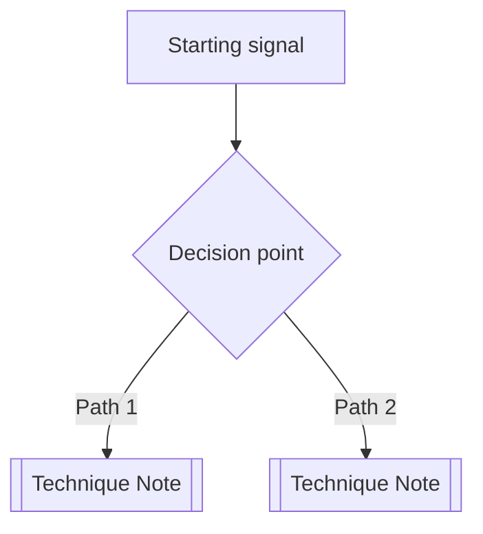

# <% tp.file.title %> — Map of Content

> What this MOC covers and when to consult it. One sentence.

## Decision flow

## Techniques (auto-populated)

| File | phase | domain | status |
| ---- | ----- | ------ | ------ |

## Manual ordering by importance

If the auto-list doesn't reflect priority, override here:

### Highest yield (try first)

- \[\[]]
- \[\[]]

### Situational

- \[\[]]

### Last resort

- \[\[]]

## Tools commonly used in this phase

- \[\[]]

## Cheat sheets

- \[\[]]

## Common pitfalls across this phase

-

## Cross-references

- Related MOCs: \[\[]]
